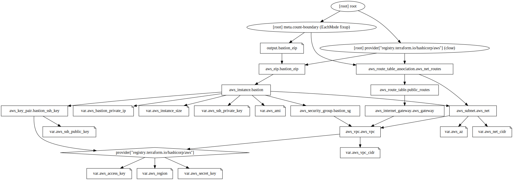

terraform-aws-ec2-instance
==============================

Template a VPC, Internet Gateway, Network, Security Groups and Instance with Elastic IP.

The public IP address (Elastic IP) will be outputted at completion

Default configurations are for a T2.Medium bastion (jump box) running Debian 11

Requirements
------------
Requires Terraform 1.0.8 or later.

Terraform Variables
--------------
The following is configurable in `terraform-aws-ec2-instance.auto.tfvars`
* Region and Availability Zone
* AMI IDs
* Application Credentials
* SSH Keys
* Instance Size
* IP Addressing

Graph
-------------

License
-------
GPL-3.0 License

Author Information
------------------
This template was created by Dan Kir
